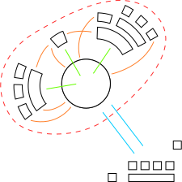

# Codebase stewardship at the Foundation for Public Code

## Diagram

## Points to get across

* The Foundation for Public Code does codebase stewardship for community, quality, support and product.

Our particular flavour of community, quality, support and product stewardship can be found on our [codebase stewardship activities](../activities.md), and the value proposition of our stewardship on our [value proposition mapping](../../value-and-impact/index.md) page.
