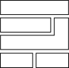

# Software as components

## Diagram

## Points to get accross

* Modern software is not a single monolithic application
* Modern software is made up of components
* Components can be made up of other components

## Examples

### Digital

A website is made up of a component that lets you write the content, a component for the database to store things, a component for the front end that shows it, and a component for the software that links these components together.

### Metaphorical

A municipal water system functions like a single system, but every distict and house has their own connects, water tanks, boilers, pipes, taps and so forth. These pipes and taps are generic components that make up the whole - they are interchangable and can be used in different contexts - from houses to streets to gardens.
