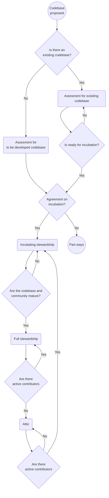

# Codebase stewardship lifecycle

How we deliver codebase stewardship is based around the lifecycle of stewardship.

```mermaid
graph TD;
    S0((Codebase<br />proposed)) --> S1{Is there an<br />existing codebase?};
    S1 -->|No| S2(Assesment for<br />to be developed codebase);
    S1 -->|Yes| S3(Assesment for exisiting codebase);
    S2 --> S5{Agreement on<br />incubation?};
    S3 --> S4{Is ready for incubation?};
    S4 -->|No| S3;
    S4 -->|Yes| S5;
    S5 -->|Yes| S7(Incubating stewardship);
    S5 -->|No| S6((Part ways));
    S7 --> S8{Are the codebase and<br />community mature?};
    S8 -->|No| S7;
    S8 -->|Yes| S9(Full stewardship);
    S9 --> S10{Are there<br />active contributors};
    S10 -->|Yes| S9;
    S10 -->|No| S11(Attic);
    S11 --> S12{Are there<br />active contributors};
    S12 -->|Yes| S7;
    S12 -->|No| S11;
```
