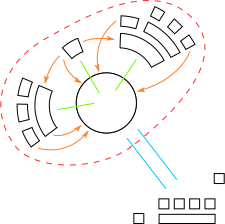

# Codebase stewardship at the Foundation for Public Code

## Diagram

## Points to get across

* The Foundation for Public Code provides codebase stewardship for community, quality, support and product.

More information can be found on our [codebase stewardship activities page](../codebase-stewardship/activities.md), and the [value proposition mapping page](../value-and-impact/index.md).
