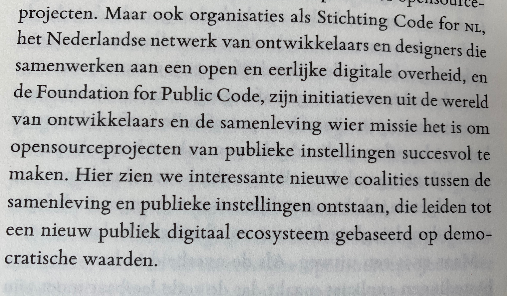

# All press and media mentions of the Foundation for Public Code

Here's the complete list of all mentions of the Foundation for Public Code on third party platforms.

We're always happy to work with journalists  - just email us at <press@publiccode.net>.

You may also be interested in:

* [a list of policy documents that mention the Foundation for Public Code](policy-documents.md)
* [our conference talks and articles we've written](https://projects.publiccode.net/talks-and-articles.html)

## 2021

* [Leading European Open Source Non-Profit Organizations Announce OSPO Alliance To Promote Best Practices in Open Source Governance](https://newsroom.eclipse.org/news/announcements/leading-european-open-source-non-profit-organizations-announce-ospo-alliance) - press release announcing the launch of the OSPO Alliance by the Eclipse Foundation (June 2021)
* [Help: open source software will be mandatory, now what?](https://opensource.pleio.nl/news/view/7155b323-98f4-4ca0-9777-7a53ffbf2d16/help-open-source-software-wordt-verplicht-wat-nu) - summary of a panel discussion with Boris van Hoytema, Ivonne Janssen-Dings and Koos Steenbergen at the Conferentie Nederland Digitaal on [opensource.pleio.nl](https://opensource.pleio.nl) (in Dutch) (February 2021)
* [Open enables public sector digital transformation in the Netherlands](https://joinup.ec.europa.eu/collection/open-source-observatory-osor/news/we-liberated-our-own-data-silos-market) - overview of OpenZaak's development by Sivan Pätsch on the [Open Source Observatory and Repository](https://joinup.ec.europa.eu/collection/open-source-observatory-osor) (OSOR) (April 2021)

## 2020

* [5 big ideas for fixing global cities’ most daunting challenges](https://fortune.com/2020/02/17/cities-challenges-solutions-housing-buses-climate-loneliness/) - article by Lydia Belanger and Emma Hinchliffe on [Fortune.com](https://fortune.com) (February 2020)
* [Next-Generation Engagement Platforms, and How They Are Useful Right Now (Part 1)](https://civichall.org/civicist/next-generation-engagement-platforms-and-how-are-they-useful-right-now-part-1/) - article by Matt Stempeck on [CivicHall.org](https://civichall.org) (May 2020)
* [The sixth version of Standard for Public Code has been released on GitHub and the development of version 0.2.1 is open for contributions](https://joinup.ec.europa.eu/collection/open-source-observatory-osor/news/new-release-standard-public-code) - article by Charlotte Heikendorf on the [Open Source Observatory and Repository](https://joinup.ec.europa.eu/collection/open-source-observatory-osor) (OSOR) (May 2020)
* [Public Interest Podcast episode 2](https://public-interest-podcast.podigee.io/2-episode-2) - interview with Olaf-Gerd Gemein about applying the Standard for Public Code in Germany (in German) (June 2020)
* [Sylk Suite wins the Innovation Award 2020](https://awards.isoc.nl/innovatie/2020/) (in Dutch) - press release announcing that we won the 2020 Internet Society Netherlands encouragment award (June 2020) (in Dutch); see also [our blogpost](https://blog.publiccode.net/news/2020/06/17/isoc-encouragement-award-consider-us-encouraged.html)
* [Open source development works to improve contact tracing in Europe](https://opensource.com/article/20/7/open-source-contact-tracing) - article by J. Manrique Lopez de la Fuente on [Opensource.com](https://opensource.com/) (July 2020)

## 2019

* [Foundation for Public Code: How to help governments develop high-quality, sustainable, cost-effective, and low-risk public services through open source collaborations](https://os2.eu/blog/foundation-public-code-how-help-governments-develop-high-quality-sustainable-cost-effective-and) - interview by Charlotte Heikendorf with Boris van Hoytema and Claus Mullie for [OS2](https://os2.eu/node/332) (September 2019)
* [The Internet is Broken](https://www.singeluitgeverijen.nl/de-geus/boek/het-internet-is-stuk/) - book by Marleen Stikker (November 2019) (in Dutch)

