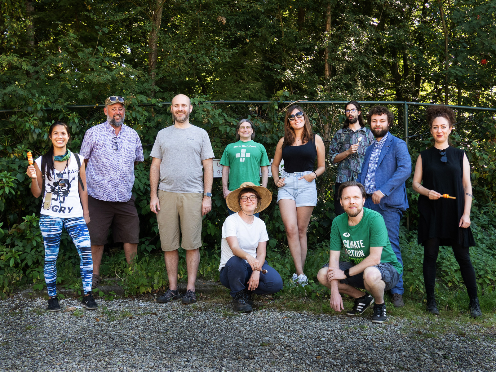
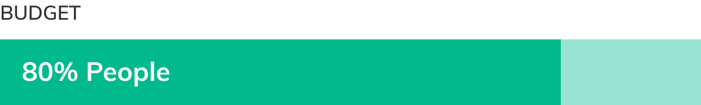

# Annual report 2019-2020

Foundation for Public Code vereniging

## Preface

### Foreword from the President

When we began our mission at the Foundation a mere two years ago, the world was a very different place. In most civic and state governments, software services were considered externalities, products procured as fixed commodities, or processes best delegated to large multinational corporate providers. But the events of the last year have reshaped the relationship between how we work and the tools that provide the framework to do so. The pandemic has upended traditional notions of paper-based bureaucracy and co-located workplaces, moving conversations into Zoom and legislation into Microsoft Teams.

Even before the current crisis, the way we govern ourselves was becoming software-driven at its very core. As more and more public institutions undergo digital transformation, the codes we use to govern ourselves (which we call policy) are being implemented more in code executed by machines (which we call software). These expressions of policy are not commodities that can be completely outsourced to big corporations, but are instead open pieces of public infrastructure that must reflect the values of the societies they serve.

This new type of codebase—the holistic integration of policy and software implementation—is what we call public code.

Cities like Amsterdam and Barcelona, before becoming our early partners, experienced the dangers of vendor lock-in that corporate service providers have long used to extract value from public administrations—without providing access to the fundamental architectures necessary for adapting to local values. They took the first step to escape this lock-in by embracing open source, with local vendors responding to smaller, open procurements, but like many open source efforts, they encountered the problem of carrying the burden of maintenance and risk for their unique creation in the future.

What they had discovered was one of the core concepts powering the titans of Silicon Valley: software is not a thing you can produce and be done with, but an ongoing process. An open source production environment is sustained through the creation of a living community of development. In the context of public code, these communities must be formed between municipalities and states which don’t ordinarily consider collaborating with their peers as part of their mandate.

We call the activity of creating the spaces, processes and tools necessary for this public collaboration Codebase Stewardship. It is the core function of the Foundation for Public Code.

When we launched the Foundation, our goals were simple: we would build communities across public organizations to steward codebases, attain financial security, and help generate awareness while educating the ecosystem.

As you’ll see in this report covering our first financial year (2019-2020), we have worked hard to prove our codebase stewardship approach, build communities, and ensure our longevity. In the year ahead, we’ll focus on demonstrating the value of collaboration at scale, guiding the ecosystem, and creating broader awareness of the value of the Public Code approach.

Writing this in early 2021, we seem headed toward a cautious recovery from the COVID-19 crisis. Navigating the potential fallout from the pandemic will require national and international deployments of relief and recovery spending, on a scale unparalleled since the great public works of the early 20th century. The projects undertaken in this global rollout will generate countless software components fundamental to the building, management, and maintenance of new, critical infrastructure.

In this crucial moment, we must educate the institutions acting on these projects about the vital importance of public code as a strategy for building open, inclusive, sustainable, accountable, and resilient public digital infrastructure for the future.

In the coming years, the Foundation will provide awareness, education, and share our proven stewardship approach through media, symposia, and press activities. We believe a mature public code ecosystem, in which communities of public organizations around the globe collaborate on codebases that provide all variety of infrastructural services, will fundamentally transform the relationship between citizens and their governments. Dynamically adaptive participatory frameworks for urban planning, spatial computing, social identity and communication, and public media consumption and production can all be made more inclusively available and accountably open. Traditional urban institutions like the transit network, the library, and the community center can become new vitally network-enabled public platforms.

In a world where the mission of the Foundation for Public Code is fully realized, the process of governance itself becomes more responsive, resilient, and better prepared for the challenges we all face in the 21st century.

**Ben Cerveny**,
President, Foundation for Public Code

4 May, 2021 — Amsterdam, Netherlands

### Mission

#### “The Foundation for Public Code enables public-purpose software and policy that is open and collaborative.”

We are building a unique association of ambitious public organizations that share codebases for the benefit of citizens—organizations that know how vital stewardship is for scaling shared software projects.

> **Public code** is both civic code (such as policy or regulation) and computer source code (like software and algorithms) executed in a public context, by humans or machines.

## Achievements in 2019-2020

### Overview: we’re proud of what our team and communities achieved in the past year

> This report covers our first financial year, from July 2019 to December 2020. In the Netherlands the first financial year is usually the remainder of the calendar year and the next full year.

In 2019, we officially began helping wholly taxpayer-funded public organizations collectively develop and maintain public code. Our research and development illuminated gaps in the public code ecosystem, and tested our riskiest hypotheses.

We engaged with governmental organizations at all levels to join us as members, and invested in resources to become a partner they can rely on years into the future.

Our purposeful community building proved to be an advantage during the COVID-19 pandemic, which led us to accelerate our planned transition to remote-first.

We launched the [Standard for Public Code](https://standard.publiccode.net/), to the approval of our growing community. Their experience in applying it to their codebases have led to [seven iterations so far](https://standard.publiccode.net/CHANGELOG.html).

Our stewardship approach matured through working with our first codebase communities. Civil servants, developers and vendors appreciated structured support to achieve their goals and grow their ambitions.

Generous philanthropic gifts allowed us to establish an open organization with scalable operations and global reach.

We’ve been mentioned in [four government strategies](https://about.publiccode.net/activities/value-and-impact/policy-documents.html), including [a letter to Dutch parliament](https://www.rijksoverheid.nl/documenten/kamerstukken/2020/04/17/kamerbrief-inzake-vrijgeven-broncode-overheidssoftware) by Raymond Knops (State Secretary for the Interior and Kingdom Relations). The letter committed the Dutch national government to an ‘open by default, unless’ approach to publishing source code.

Marvelously, one public organization became a member of our association: the province of Zuid-Holland in the Netherlands. [They believe](https://www.zuid-holland.nl/overons/bestuur-zh/gedeputeerde-staten/besluiten/2020/september/1-september/lidmaatschap-foundation-for-public-code-vereniging/) their “membership will for the first time provide a solid structure for open source software that the province procures and develops”.

Finally, we learned that collaborating in the open is new for much of our community, and often ourselves! Honoring our commitment to build an open organization, we continuously evolved our approach to problems, the tools we use, and how we interact with our community members. As we define the expanding edges of our organization, we are discovering our community is broader—and their engagement deeper—than we dared hope for.

### Established a transparent and expert organization, dedicated to the public interest

#### Became a public benefit association

On June 3, 2019, we established the Foundation for Public Code as a public benefit association under Dutch law. We set off to find an office (post-pandemic, come visit us at Keizersgracht 617 in Amsterdam!), hire staff, and launch operations. Basics in place, we embarked on our mission to guide international collaboration among public organizations on codebase design, quality and governance.

#### Built and operated our organization transparently

Our operations are designed to benefit our members long into the future. [We publish all our workflows and protocols](https://about.publiccode.net/activities/), so the wider community can learn from (and even fork) our organizational form. We prioritize open source tools and services, documenting our methods as we go. [See an overview of our tools](https://about.publiccode.net/activities/).

Our robust financial administration is set up to receive membership dues and philanthropic donations, we have a budget forecasting mechanism, and we work with the [King Baudouin Foundation United States (KBFUS)](https://kbfus.networkforgood.com/projects/52915-p-kbfus-funds-foundation-for-public-code-nl) to facilitate funding from US-based donors.

#### Our efforts are roughly divided into four primary activities

| | |
| - | - |
| Steward codebases | 50% |
| Build community | 20% |
| Educate the ecosystem | 20% |
| Secure funding | 10% |

#### Grew and recruited from a deep talent pool

We doubled our initial team to ten brilliant colleagues, including experts in municipal collaboration, community building, open source development and digital transformation in government, and are supported by three consultants boosting our capabilities in design, illustration and finance.

#### Secured funding (with more lined up for the future)

We wouldn’t be where we are today without our donors, who believe we are integral to the structural solution to scale open source software in public organizations. Generous donations from **Arnout Schuijff** (co-founder, Adyen), **Stewart Butterfield** (CEO, Slack Technologies) and **Josh Elkes** (CEO, Harbour) enabled us to develop our stewardship operations, conduct research and development, and raise awareness around public code. As a public benefit organization and with the KBFUS Public Code US fund, gifts in both the Netherlands and the United States are tax deductible.

Our donors pledged nearly €3 million in 2019 and 2020.

### Launched the Standard for Public Code

#### The model helping organizations successfully build reusable open source services, platforms and applications

We were so eager to launch the [Standard for Public Code](https://standard.publiccode.net), we published it in April 2019, before finalizing the legal paperwork for our association. The Standard is the first set of criteria to define good practices for public code, and guides organizations to develop and maintain their own solutions to enable successful reuse by others. It’s used by policy makers, business and project managers, developers and designers.

The Standard was born out of a collaboration between our co-founders Ben and Boris, the City of Amsterdam, and the Amsterdam University of Applied Sciences. Together, they conducted the ‘[Smart Cities? Public Code!](https://smartcities.publiccode.net/)’ research project, which aimed to contribute to the transition from proprietary smart city software to the design and deployment of ‘public software’ developed by cities themselves.

The Standard is a living document, and will continue to be the most important tool we use to support our public partners. Codebase stewards make sure codebases under our care are of high quality, collaboratively maintainable, and supported by adequate documentation by checking work against the Standard’s criteria.

Together with Open & Agile Smart Cities (OASC), we developed an introductory course to the Standard, which can be completed for free in the virtual [CITYxCITY Academy](https://citybycity.academy/course/standards-for-smart-cities).

### Invited public organizations to join us as members

Supporting public organizations interested in joining our association has been a priority since day one. We’ve had inbound interest from over thirty government entities: 20 municipalities, 4 frameworks for municipal collaboration, 1 province, 4 national governments, and 2 European directorates.

In 2020, the Province of Zuid-Holland (the Netherlands) became our first member. Together, we’re exploring how best to involve members in the collaborative governance of our association, and to build meaningful member relations. [Zuid-Holland states](https://www.zuid-holland.nl/overons/bestuur-zh/gedeputeerde-staten/besluiten/2020/september/1-september/lidmaatschap-foundation-for-public-code-vereniging/) their “membership will for the first time provide a solid structure for open source software \[we\] procure and develop. …we as an organization endorse the objectives of the association.”

As we gained momentum among civil servants and developers, we expected building an association governed by public organizations to be a slow process. Despite many civil servants’ great advocacy for public code, aligning all decision-making parts of an organization takes time. This is appropriate—we hope our governments will be wise stewards of our society’s collective resources, and this is normally expressed through a conservative approach to new ideas. Building on our clearer understanding of public organization timelines, we’re iterating on how we attract new members.

### Began Codebase Stewardship

#### Everything a project needs to be sustainable, collaborative and trusted

Our work with government technology projects led us to hypothesize that thriving public organizations require extra support and best practice guidance in four areas: code quality, community building, product development and marketing, and empowering vendors. We’re proud to have validated our approach in our first financial year.

Our stewards help organizations implement the guidance and best practices set out in the Standard for Public Code. Our expert advice in open source collaboration gives public organizations and market parties confidence in their future work together, while guiding organizations toward the control they need, and vendors toward sustainable business models. The result is a growing and sustainable codebase community, with the documentation and experience to help other teams understand the benefits of and implement a codebase.

Over the course of the financial year, three codebases entered our stewardship program: Digital Omgevingsbeleid, Signalen and OpenZaak.

We discovered:

* Open source governance—the strategy, priorities and decision-making that guide product growth—is uniquely challenging for civil servants. To help, we developed a game communities are using to learn about interdependent responsibilities in role based systems. [See more about the Governance Game](https://youtu.be/Dt0WFla4eeM).
* Market parties must be as involved as public organizations in the codebase community so they can build long-term sustainable business models. As part of the [OpenZaak market consultation](https://github.com/open-zaak/open-zaak-market-consultation), we developed a process of working with market parties to define governance benefiting everyone involved.
* Our value increases for communities with international ambitions and unique products (i.e. less commodified commercial competition).

#### Assessing the Digital Omgevingsbeleid codebase

##### Stewardship is increasing environmental and civic sustainability, efficiency and transparency in Zuid-Holland

Our first member, the Province of Zuid-Holland, is developing a tool to let both policy makers and citizens explore all environmental laws and policies, see where they apply, and compare them to previous versions.

For example, if someone wants to build a wind farm, they can quickly understand what's allowed on their prospective site. Digital Omgevingsbeleid also makes it easier for a civil servant considering new regulation to see how the new regulations will interact with regulations that already apply.

We helped the team get ready for working in the open by:

* preparing the team and management to work in the open
* preparing the team’s assets for publication
* advising on code quality to support reusability and transparency

[See the current status for Digital Omgevingsbeleid](https://publiccode.net/codebases/omgevingsbeleid.html).

#### Stewarding the Signalen codebase

##### Our stewardship is enabling collaboration on and reuse of Amsterdam’s mission-critical reporting system, across the Netherlands and beyond

The Signalen community’s stewardship ambitions are an important milestone in their commitment to openness and collaboration.

Originally developed in Amsterdam, Signalen is an open source solution for receiving, classifying and prioritizing citizens’ nuisance reports about the public space. The process and task system handles over 300,000 reports each year, automatically categorizing and routing reports to the appropriate handlers.

In cooperation with the Association of Netherlands Municipalities (VNG), our codebase stewards established the community and collaboration with municipalities and vendors. We've conducted this process entirely in the open, enabling further adoption and reuse within the Netherlands and beyond.

Our work included:

* Supporting VNG with scale-up and adoption strategies
* Organizing a community day with municipalities
* Organizing product development workshops with civil servants
* Increasing collaboration potential by clarifying branching and GitFlow models, adding unit test automation, integration testing, and engineering guidelines
* Establishing collaborative open documentation to keep track of learnings on how to implement and reuse Signalen

##### Results for Signalen

* Implementation in ‘s-Hertogenbosch, progress in Almere, and testing for re-use in five further municipalities
* An established governance structure, including shared product management, feature roadmaps and technical steering
* Amsterdam opened its internal budget for development to co-sponsor features needed by other community members
* A new product website in both English and Dutch
* An online documentation hub
* A community video explainer

[See the current status for Signalen](https://publiccode.net/codebases/signalen.html).

#### Stewarding the OpenZaak codebase

##### Our stewardship is integral to the evolution of fundamental services for 45+ Dutch municipalities

The OpenZaak codebase is currently in incubation with our codebase stewardship team. It is an open source case register API provision platform for municipalities who want to deliver citizen-friendly services online.

OpenZaak is a production-ready API platform that implements a widely used standard for case-oriented working. It allows municipalities to offer safe and reliable online services to their citizens. Because OpenZaak relies on the Dutch national case-oriented working standard, it becomes easier to securely exchange data with other municipalities or applications.

OpenZaak was initially developed by Maykin Media B.V. and commissioned by the municipalities of Amsterdam, Rotterdam, Utrecht, Tilburg, Arnhem, Haarlem, ‘s-Hertogenbosch, Delft, Hoorn, Medemblik, and a coalition of Stede Broec, Enkhuizen and Drechterland (SED), under coordination of a Dutch municipal association, Dimpact.

Our work included:

* Advising the Dimpact association on procurement and adoption strategy
* Organizing a market consultation to co-create codebase governance and community dynamics, and better understand vendor business models and risk sharing. (>10 vendors participated)
* Organizing a workshop with municipalities and vendors to identify needs for increasing adoption and re-use
* Working closely with the commissioning municipalities to help them grow OpenZaak to a trusted codebase with different types of vendors, offering a range of services using OpenZaak
* Supporting and encouraging vendors to contribute to governance and develop services based on OpenZaak, ranging from hosting to full-service provisioning

##### Results for OpenZaak

* OpenZaak maintainers consider the Standard for Public Code integral to achieving their vision
* Joint codebase governance by vendors and municipalities through established technical and product steering groups
* Community independently organizes and conducts technical and product steering meetings
* Established and documented process for security incidents
* A new product website in both English and Dutch

[See the current status for OpenZaak](https://publiccode.net/codebases/openzaak.html)

### Welcomed as a valued member of the ecosystem

We engaged widely with the public code and government digitalization ecosystem via project contributions, public talks, and creating new channels to exchange knowledge with the communities imagining and building the digital infrastructure of the future.

We are well on our way to becoming a beacon for international, public sector open source collaboration.

#### Speaking up

We spoke, sat on panels, and raised awareness about public code and our work at 26 events in 2019 to 2020. [Check out our recorded talks](https://projects.publiccode.net/talks-and-articles.html).

#### ‘Let’s Talk About Public Code’ podcast

In September 2020, we began interviewing public code champions, including initial guests Arnau Monterde (Decidim) and Rasmus Frey (OS2). [Listen to past episodes](https://podcast.publiccode.net/).

#### Community calls and community day

We hosted 30 community calls to exchange experiences and get feedback on our work and the Standard for Public Code. We organized our first event in October 2019, with stewardship workshops, Governance Game demos, and learned how other codebase teams approach their work. Attendees from five public organizations traveled internationally to attend.

#### Supporting codebases

We helped 22 public codebases with review and consultation.

#### Italy built a powerful system on top of our ideas - others are following

After Italy’s Team Digitale successfully based their national public code repository on our jointly developed publiccode.yml standard, the German and Dutch public code communities are looking to do the same.

#### Possible adoption as a UN Digital Public Good

Building on our [public commitment](https://blog.publiccode.net/policy/2020/10/02/we-support-the-sustainable-development-goals.html) to the Sustainable Development Goals in September 2020, we proposed the Standard for Public Code for adoption as a Digital Public Good. While our application approval is pending, we’re proud that the Standard is [recommended to other aspiring Digital Public Good projects](https://github.com/DPGAlliance/DPG-Resources).

#### More involvement

* Gave feedback on a draft of Open Source Observatory and Repository’s [Guidelines for Sustainable Open Source Communities in the Public Sector](https://joinup.ec.europa.eu/collection/open-source-observatory-osor/news/supporting-oss-communities-public-sector)
* Contributed to the State of California’s ['Vision 2023’ Technology Strategic Plan](https://vision2023.cdt.ca.gov/)
* Part of Amsterdam’s [Sourcing and Open Source Strategy](https://amsterdam.raadsinformatie.nl/document/7880446/1/09012f9782a30a08) to achieve goals set out in [A Digital City Agenda](https://www.amsterdam.nl/wonen-leefomgeving/innovatie/de-digitale-stad/) (in Dutch), and mentioned in the [Mid-term report](https://amsterdam.raadsinformatie.nl/document/9725293/1/09012f9783374971)
* We’re included in the Swedish [open data knowledge sharing wiki](https://gitlab.com/open-data-knowledge-sharing/wiki/-/wikis/Standard-for-Public-Code) and the EU’s Open Source Observatory’s [resource catalog](https://joinup.ec.europa.eu/collection/open-source-observatory-osor/specific-resources#section-32)
* Provided guidance to multiple governments’ development of resources and policy, including the Association of Netherlands Municipalities, Dutch Ministry of the Interior and Kingdom Relations, and European Commission
* Ran workshops for European collaboration partnership [SCORE](https://northsearegion.eu/score)

## About us

### Our work is getting noticed

As we build stronger awareness of public code, the press and other organizations have taken interest in our work. We were covered or mentioned nine times, ranging from interviews with staff to articles covering new releases of the Standard for Public Code.

[See all mentions](https://about.publiccode.net/activities/value-and-impact/all-press.html).

> “The Foundation for Public Code won the Encouragement Award 2020. The jury sees great potential in the initiative and looks forward to a structural contribution to a healthy open source culture within the public sector.” — **ISOC 2020 Innovation Award** press release

In June 2020, the Dutch chapter of the Internet Society (ISOC) recognized our work with the 2020 Aanmoedigingsprijs (Encouragement Award). We were proud to be nominated for the annual Innovation Award, and delighted by Internet Society Netherlands’ recognition.

> "The Foundation for Public Code is helping our collaboration of Dutch cities to increase our code quality, and making codebases more accessible for others to use" — **Jacco Brouwer**, the association of Dutch municipalities (VNG-Realisatie)

> “OS2’s board and secretariat have a continued focus on international cooperation, and the exporting of OS2 open source products for use outside Denmark. In that matter, we wish to work with the Foundation for Public Code, as we consider it a very strong bid for the best cross-governmental collaboration partner at the European level.
> We are well aware that for the OS2 portfolio to perform internationally, demands will be higher—and this is not a task we can fulfil ourselves. Cooperation with the Foundation for Public Code can increase the international viability of our open source products.” — **Rasmus Frey**, Chief Executive, OS2 (Danish Public Digitalization Network)

### Our people

**In 2019, our initial team included:**

* **Boris van Hoytema** (Chief Executive, co-founder)
* **Ben Cerveny** (President, co-founder)
* **Elena Findley-de Regt** (Communications Coordinator)
* **Claus Mullie** (Codebase Stewardship Coordinator)
* **Mirjam van Tiel** (Operations Coordinator until December)

with **Willemijn van Bekkum** providing pro-bono legal and human resources support.

**They were later joined by:**

* **Eric Herman** (Lead Codebase Steward for Quality)
* **Jan Ainali** (Codebase Steward for Community)

with **Floris Deerenberg** and **Ryan Conlan** providing ad hoc illustration, design and communication support.

**In 2020, we welcomed:**

* **Deborah Meibergen** (Operations Coordinator)
* **Alba Roza** (Codebase Steward for Community)
* **Laura Scheske** (Membership Developer)
* **Felix Faassen** (Codebase Steward for Product)

with **Rob Schouten** providing financial expertise together with our bookkeepers from Get Monkeys.

### Our board of directors

* **Arnout Schuijff** (Treasurer)
* **Ben Cerveny** (Chairman)
* **Boris van Hoytema** (Secretary)
* **Pieter van der Does**

Board members do not receive any compensation, and did not incur any expenses for their activities.

## Our Finances

This section provides an overview of the financials that accompanies this annual report.

[See the full financial report](https://about.publiccode.net/organization/annual-reports/financial-report-2019-2020).

In its startup phase, this organization was dependent on philanthropic donations. It has been the aim of the Foundation to eventually be self-supporting through the contributions of public organizations.

Generous philanthropic donations have allowed us to expand our stewardship operations, conduct research and development, and raise awareness around public code. Our donors pledged a total of €2,983,857 in 2019 and 2020. To prevent undue influence, all donations are un-earmarked and go into our general operating budget, in compliance with our status as a Dutch public benefit organization (ANBI).

During this startup phase, we try to look two years ahead with our financial planning. The organization has low financial risk: it is not capital intensive (no large capital expenditures) and has no loans with regard to the organization’s assets.

The current financial situation gives the Foundation for Public Code financial security until April 2022.

**Our largest cost by far (really, our biggest investment) is the amazing people who make our work possible. This includes their salaries, wage taxes, insurances and expenses.**

**Our other costs:**

* Office and admin (VoIP telephony, insurance, tools, furniture for working from home, equipment and subscriptions to enable our staff to do their best work)
* Project and community costs (events, community tools, travel for conferences and meetings with the community, design, marketing and market research)
* Fundraising and membership development
* Interest expenses from the loan gift

### Financial details

Total costs in 2019 and 2020 were €1,170,158.

| Costs (in €) | 2020 | 2019 | Total |
| --- | --- | --- | --- |
| People | 615,368 | 217,585 | 832,953 |
| Office & Admin | 36,881 | 40,000 | 76,881 |
| Project & Community | 17,596 | 27,322 | 44,918 |
| Fundraising | 117,539 | 58,080 | 175,619 |
| Other expenses | 39,787 | 0 | 39,787 |
| **Total** | **827,171** | **342,987** | **1,170,158** |

Total income in 2019 and 2020 was €801,686.

| Income (in €) | 2020 | 2019 |
| --- | --- | --- |
| Contribution members | 2,486 | 0 |
| US Gifts | 367,700 | 0 |
| (Fiscal based) gifts | 431,500 | 0 |
| **Total** | **801,686** | **0** |

#### Budget for financial year 2019-2020

With the help of financial consultant Rob Schouten, we reviewed the way our administration was set up, and created a budget template.

[See our budget for 2019 and 2020](https://docs.google.com/spreadsheets/d/1SLCXYgqUOxVfl004_DLOJc4MsOvPn5vG/edit#gid=1568320296).

#### Our financial model for the coming years

In the future, we aim to be primarily publicly-funded, with additional philanthropic support. The financial sustainability of our organization should be secured by membership dues and public funds, with philanthropic gifts used for additional activities such as awareness raising and ecosystem growth.

#### Funding loan redemption

The Foundation for Public Code Vereniging started with a funding loan to cover running costs, provided by one of the founding members. The duration of the loan was five years, at an interest rate of 3%. A yearly redemption is granted to the Foundation. This funding loan was redeemed in 2020.

#### Impact of the Covid-19 crisis and our continuity

The Covid-19 crisis affected our freedom to do things and the effectiveness of our work. Due to travel restrictions and national containment measures, we were not able to meet with public organizations or attend events abroad, and our staff had limited possibilities to work in the office. Despite the physical limitations, we were able to maintain and generate relationships using digital means. Due to the composition of our income stream, we do not expect a negative impact of the Covid-19 crisis on our operations in the short term. The Foundation for Public Code is in the start-up phase and has not been able to build up resilience, for example in the form of a continuity reserve. As indicated earlier, the organization has a liquidity buffer until April 2022.

## Our ambitions for the next year

### The Chief Executive’s vision

In 2021, we’re leveraging what we’ve learned to transform our emerging idea into an innovative public organization that can scale and effectively deliver on the goal in our articles of association:

> To support collective development and maintenance of public code, in order to reduce risk, increase quality, reduce cost and increase sustainability.

This coming year, we’re shifting from start-up to innovative public organization. Central to this is our plan to develop the most impactful examples into compelling stories that will accelerate worldwide adoption of public code.

Meanwhile, we’ll continue to develop an ecosystem with a place for public organizations and private businesses to collaborate successfully, by providing the missing infrastructures that require a third party. This includes supplying team guidance, ecosystem development advice, and policy compliance certification, while supporting the collective development and maintenance of public code.

Above all, we’re supporting the development of the new profession of digital public workers, while removing their roadblocks to new knowledge and skills, and enhancing their ability to operate across cultures while providing longer-term sustainability.

#### Read on for how we plan to expand our impact in 2021 and beyond

* increase community awareness and skills
* steward codebases to illustrate public code’s value
* publish a more global and broadly useful Standard for Public Code
* strengthen and diversify our collaborations
* clarify our impact, and exemplify an open public organization

### Increase public code skills and awareness

Public code enables governments to undergo digital transformation in a responsible, effective and inclusive way. We often see that once people understand public code, they immediately get excited about its value.

To highlight the importance of public code and teach more people how to use it in their work, we’ll work with our community to create new explainer videos, resources and training materials for a wide range of people—from policy experts to operational management, from vendors delivering software to residents.

### Steward OpenZaak, Signalen and Omgevingsbeleid to maturity

The first codebases we stewarded grew significantly over the last year despite still being in our Incubation phase, and have helped prove the value of a committed third party stewarding the codebase.

To help these codebases mature, we will continue working with their communities to:

* grow their international reach
* boost their public profile
* co-develop equitable and evolving shared governance
* improve codebases until they fully comply with the Standard for Public Code
* support them in becoming exemplary public technologies and open source projects

### New stewardships illustrating the value of public code

The codebases we currently steward have given us evidence for the viability and success of public code. For public code to truly fulfill its potential, there are other stories we need to share and amplify.

This year, we'll support new codebases that help us further demonstrate the full possible impact of public code. For example, a codebase with a thriving international community will better enable us to counter critics concerned that national legal context is too big an obstacle.

### A more global Standard for Public Code useful to non-developers

The Standard for Public Code has proven its value in showing that public code is operationalizable in technology. When the Standard is used not just by developers, but also operational management and policymakers, it is even more effective.

This year we’ll get them more involved in making the Standard a guide for helping teams collaborate with and better understand each other. We’re especially interested in making it useful to people communicating how algorithms execute policy, and those tasked with organizing the purchase and execution of public code projects.

To expand use of the Standard, we’re working with our growing community to translate the introduction and support its use in non-English language environments.

### Strengthen our place between and relationship with public organizations

Our work is pivotal in reducing risk, increasing quality, reducing cost and increasing sustainability of digital public services. This can have a significant impact on the government software market and its business models.

To do this well, our broader ecosystem must play an active role in setting our strategy and roadmap—even if membership isn’t feasible for them.

We’ll also continue to grow our membership, so we can transfer oversight from our founders to organizations that can guarantee public governance.

### Enable more diverse in-kind and financial contributors

To build a better, larger community, we’ll expand beyond membership into new ways to contribute. Like in any good open source project, more contributions should be encouraged from those who stand to benefit.

To accommodate a wider group of people, organizations will be able to contribute by partially seconding someone on their staff, subsidizing ecosystem building efforts, and in many other ways.

Having a broader public organization support base lets us work toward sustainably funding our operations using only money from public sources, with outreach and awareness-raising covered by philanthropic gifts.

We’ll also set up a program inviting international subject-matter experts to advise us, or act as ambassadors on our behalf.

### Prove our impact

Infrastructure is the long-term foundation for more immediate work, and as such tends to be taken for granted. Similarly, the infrastructural value we provide through codebase stewardship or framework definition (like the Standard for Public Code) and analysis can go unnoticed even by those who could not imagine their work without it.

High-profile contributions of work, resources or funding help signal our value. To attract and retain members, additional maintainers, and philanthropic donors, we need to better articulate the value we add to public sector digital transformation. In the coming year, we’ll produce more case studies, business cases and testimonials.

### Professionalize an exemplary open public organization

Our vision of a flourishing ecosystem of public code contains inherent assumptions about how a responsible and professional public organization behaves. This includes learning in the open and having strong, accountable processes—not just at the codebase level, but across the organization.

At the Foundation for Public Code, we hope to be a model public organization that others look to as an example.

This coming year, we’ll further develop strong, open, transparent and fair processes for:

* our internal personnel, financial and organizational processes
* how we support others

### Conclusion

If we’ve learned one thing since we launched, it might be: we hold an important piece of the public digital transformation puzzle.

For now, we seem to be on the front line of a big change: the government of the future will be open.

Thanks to our community, expertise, momentum and team, we’re uniquely positioned to go at these challenges head on. And we’re excited to do so.

I hope you’ll be joining us!

**Boris van Hoytema**,
Chief executive, Foundation for Public Code

4 May 2021 — Amsterdam, Netherlands
